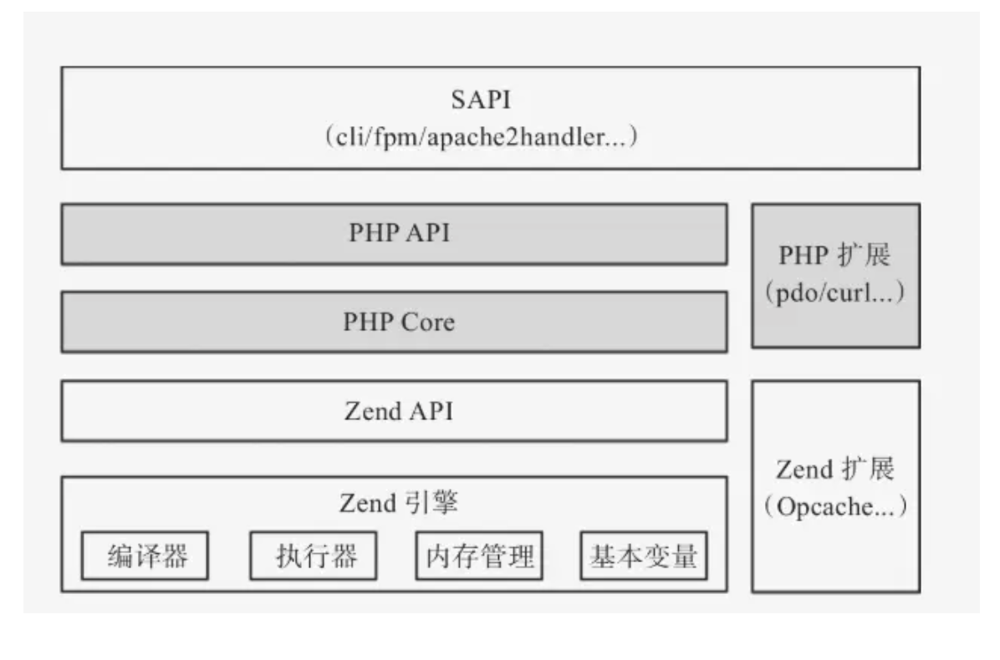

# PHP执行过程

## 执行过程
php是解释型语言,执行过程需要先编译成中间代码,再由虚拟机翻译成指定的指令执行
```php
php源码->Token->抽象语法树->Opcodes->执行
```
## 步骤解释
- **Token**: php源码通过词法分析得到Token。Token 是 PHP 代码被切割成的有意义的标识。PHP7 一共有 137 种 Token，在zend_language_parser.h 文件中做了定义。

- **抽象语法树(AST)**: 基于语法分析器将 Token 转换成抽象语法树（AST）。Token 就是一个个的词块，但是单独的词块不能表达完整的语义，还需要借助一定的规则进行组织串联。所以就需要语法分析器根据语法匹配Token，将 Token 进行串联。语法分析器串联完 Token 后的产物就是抽象语法树（AST，Abstract Syntax Tree）。
AST 是 PHP7 版本的新特性，之前版本的 PHP 代码的执行过程中是没有生成 AST 这一步的。它的作用主要是实现了PHP编译器和解释器的解耦，提升了可维护性。

- **Opcode**: 将语法树转换成 Opcode。需要将语法树转换成Opcode，才能被引擎直接执行。

- **执行Opcodes**: opcodes 是 opcode 的集合形式，是 PHP 执行过程中的中间代码。PHP工程优化措施中有一个比较常见的“开启 opcache”，指的技术这里将 opcodes 进行缓存。通过省去从源码到 opcode 的阶段，引擎直接执行缓存好的 opacode，以提升性能。
## PHP7内核架构图
    
- zend引擎

    词法/语法分析、AST编译和 opcodes 的执行均在 Zend 引擎中实现。此外，PHP的变量设计、内存管理、进程管理等也在引擎层实现。
- PHP层

    zend 引擎为 PHP 提供基础能力，而来自外部的交互则需要通过 PHP 层来处理。
- SAPI

    server API 的缩写，其中包含了场景的 cli SAPI 和 fpm SAPI。只要遵守定义好的 SAPI 协议，外部模块便可与PHP完成交互。
- 扩展部分
    
    依据 zend 引擎提供的核心能力和接口规范，可以进行开发扩展。
## PHP源码结构
- sapi

    sapi目录是对输入和输出层的抽象，是PHP提供对外服务的规范。
    几种常用的 SAPI：
    1）apache2handler: Apache 扩展，编译后生成动态链接库，配置到Apache下。当有 http 请求到 Apache 时，根据配置会调用此动态链接库来执行PHP代码，完成与PHP的交互。
    2）cgi-fcgi: 编译后生成支持 CGI 协议的可执行程序，webserver（如NGINX）通过 CGI 协议把请求传给CGI进程，CGI 进程根据请求执行相应代码后将执行结果返回给 webserver。
    3）fpm-fcgi: fpm是 FastCGI 进程管理器。以 NGINX 服务器为例，当有请求发送到 NGINX 服务器，NGINX 按照 FastCGI 协议把请求交给 php-fpm 进程处理。
    4）cli: PHP的命令行交互接口

- zend
    
    Zend 目录是 PHP 的核心代码。PHP中的内存管理，垃圾回收、进程管理、变量、数组实现等均在该目录的源码里。
- main
    
    main目录是SAPI层和Zend层的黏合剂。Zend 层实现了 PHP 脚本的编译和执行，sapi 层实现了输入和输出的抽象，main目录则在它们中间起着承上启下的作用。承上，解析 SAPI 的请求，分析要执行的脚本文件和参数；启下，调用 zend 引擎之前，完成必要的模块初始化等工作。
- exit
    
    ext 是 PHP 扩展相关的目录，常用的 array、str、pdo 等系列函数都在这里定义。
- tsrm
    TSRM（Thread Safe Resource Manager）——线程安全资源管理器， 是用来保证资源共享的安全。

