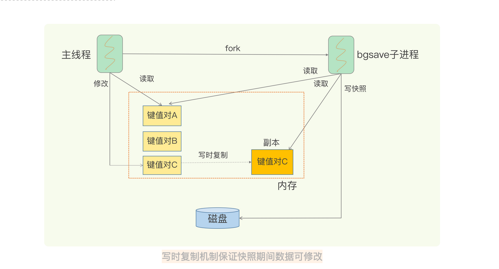

## redis重点知识
### Redis持久化(AOF和RDB)
#### AOF(记录的是操作命令(主线程复制AOF))
- 持久化机制(先写内存,后写日志(写日志顺序写,写磁盘随机写))
    1. AOF写日志时不进行语法检查(若先写log,则会造成log记录了错误的语法)
    2. 日志只记录成功的命令
    3. 执行完再记录不会阻塞当前写操作(把日志写到磁盘时,如果磁盘压力很大会写盘很慢)
    4. AOF写日志时,是在主线程完成
- AOF写回策略(写日志策略、如何控制AOF日志写回的时机?appendfsync的配置项如下)
    1. Always,同步写回：每个写命令执行完，立马同步地将日志写回磁盘
    2. Everysec，每秒写回：每个写命令执行完，只是先把日志写到 AOF 文件的内存缓冲区，每隔一秒把缓冲区中的内容写入磁盘
    3. No，操作系统控制的写回：每个写命令执行完，只是先把日志写到 AOF 文件的内存缓冲区，由操作系统决定何时将缓冲区内容写回磁盘
- AOF过大问题与处理
    1. 文件系统本身对文件大小有限制。 文件太大,再追加命令记录,效率会变低。如果发生宕机，AOF 中记录的命令要一个个被重新执行，用于故障恢复，如果日志文件太大，整个恢复过程就会非常缓慢，这就会影响到 Redis 的正常使用
    2. AOF重写机制(**由后台子进程bgrewriteaof来完成**),对过大的AOF文件进行重写，以此来压缩AOF文件的大小。 具体的实现是：检查当前键值数据库中的键值对，记录键值对的最终状态，从而实现对 某个键值对 重复操作后产生的多条操作记录压缩成一条 的效果。进而实现压缩AOF文件的大小
        1. fork子进程时，子进程是会拷贝父进程的页表，即虚实映射关系，而不会拷贝物理内存。子进程复制了父进程页表，也能共享访问父进程的内存数据了，此时，类似于有了父进程的所有内存数据
    3. 触发AOF重写 同时超出auto-aof-rewrite-min-size和auto-aof-rewrite-percentage或手动执行BGREWRITEAOF
#### RDB(二进制数据)
- RDB生成快照(save和bgsave)
    1. save：在主线程中执行，会导致阻塞。bgsave：创建一个子进程，专门用于写入 RDB 文件，避免了主线程的阻塞，这也是 Redis RDB 文件生成的默认配置
- RDB快照时数据是否能修改
    1. Redis 就会借助操作系统提供的写时复制技术（Copy-On-Write, COW），在执行快照的同时，正常处理写操作
        1. redis 生成rdb 时候会fork 子进程。此时的读写操作： 读：主线程和bgsave子进程互不影响。 写：被修改的数据会被复制一份为副本，bgsave 把副本数据写入rdb 文件，主线程修改原数据
        2. “这块数据就会被复制一份，生成该数据的副本”，这个操作在实际执行过程中，是子进程复制了主线程的页表，所以通过页表映射，能读到主线程的原始数据，而当有新数据写入或数据修改时，主线程会把新数据或修改后的数据写到一个新的物理内存地址上，并修改主线程自己的页表映射。所以，子进程读到的类似于原始数据的一个副本，而主线程也可以正常进行修改

- 多久一次RDB快照
    1. 频繁将全量数据写入磁盘，会给磁盘带来很大压力，多个快照竞争有限的磁盘带宽，前一个快照还没有做完，后一个又开始做了，容易造成恶性循环
    2. bgsave 子进程需要通过 fork 操作从主线程创建出来。虽然，子进程在创建后不会再阻塞主线程，但是，fork 这个创建过程本身会阻塞主线程，而且主线程的内存越大，阻塞时间越长。如果频繁 fork 出 bgsave 子进程，这就会频繁阻塞主线程了
    3. 增量快照
    4 混合使用RDB和AOF,在两次快照直接,利用AOF记录日志记录,等到第二次做全量快照时，就可以清空 AOF 日志，因为此时的修改都已经记录到快照中了，恢复时就不再用日志了
#### AOF 和 RDB 的选择问题
- 数据不能丢失时，内存快照和 AOF 的混合使用是一个很好的选择
- 如果允许分钟级别的数据丢失，可以只使用 RDB
- 如果只用 AOF，优先使用 everysec 的配置选项，因为它在可靠性和性能之间取了一个平衡
#### Redis支持类型和底层数据结构关系
  
#### Redis和DB数据一致性问题
当修改了数据库后，有没有及时修改缓存。这种问题，以前有过实践，修改数据库成功，而修改缓存失败的情况，最主要就是缓存服务器挂了。而因为网络问题引起的没有及时更新，可以通过重试机制来解决。而缓存服务器挂了，请求首先自然也就无法到达，从而直接访问到数据库。那么我们在修改数据库后，无法修改缓存，这时候可以将这条数据放到数据库中，同时启动一个异步任务定时去检测缓存服务器是否连接成功，一旦连接成功则从数据库中按顺序取出修改数据，依次进行缓存最新值的修改。
#### Redis并发访问
**原子操作** : 利用Redis中原子单命令操作(INCR/DECR/SET等),或者把多个操作写到LUA脚本中执行

**加锁** : 加锁操作setnx或者set+lua(释放锁时)**加锁导致并发降低且加锁业务逻辑复杂**

#### Redis事务注意事项(MULTI、EXEC)
- 命令入队时就报错(例如redis中没有的命令PUT)
    1. 在这种情况下，事务本身就会被放弃执行,这种情况事务会回滚
- 命令入队时没报错，实际执行时报错(LPOP操作字符串类型)
    1. 有错误的命令不会被执行，正确的命令可以正常执行
- EXEC 命令执行时实例发生故障
    1. 如果开启了 AOF 日志，可以保证原子性。如果没有开启RDB和AOF也可以保障原子性

#### Redis数据不一致
- 主从数据不一致
    1. 主从同步传输延迟, 即使从库及时收到了主库的命令,但是从库如果在执行其他复杂的逻辑(例如集合操作命令)而阻塞
  
    **解决方法** : 要尽量保证主从库间的网络连接状况良好。例如，我们要避免把
    主从库部署在不同的机房，或者是避免把网络通信密集的应用（例如数据分析应用）和 Redis
     主从库部署在一起
- Redis集群中读到过期数据(删除数据只在主库,从库不会执行删除)
    1. Redis 的过期数据删除策略造成,Redis 同时使用了两种策略来删除过期的数据，分别是惰性删除策略和定期删除策略
        惰性删除策略: 数据过期后不会立即删除,等再次读取这个数据时才会删除
        定期删除策略: Redis每隔一段时间(默认100ms),随机选择一些数据检查是否过期
        注意:  Redis 3.2 之前的版本，那么，从库在服务读请求时，并不会判断数据是否过期，而是会返回过期数据。在 3.2 版本后，Redis 做了改进，如果读取的数据已经过期了，从库虽然不会删除，但是会返回空值，这就避免了客户端读到过期数据。所以，在应用主从集群时，尽量使用 Redis 3.2 及以上版本。

    **解决方法** : 使用 Redis 3.2 及以上版本。使用 EXPIREAT/PEXPIREAT 命令设置过期时间，避免从库上的数据过期时间滞后

#### 缓存击穿、穿透、雪崩
**缓存击穿**: 请求热点key时,无法在缓存中处理(或者热点key过期瞬间,大量请求),导致请求打到DB上
- 原因1: Redis中热点key瞬间失效
    1. **热点key不设置过期时间**
    2. **互斥锁** : 现象是多个线程同时去查询数据库的这条数据，那么我们可以在第一个查询数据的请求上使用一个互斥锁来锁住它。其他的线程走到这一步拿不到锁就等着，等第一个线程查询到了数据，然后做缓存。后面的线程进来发现已经有缓存了，就直接走缓存
    
**缓存穿透**: 指要访问的数据既不在 Redis 缓存中，也不在数据库中
- 原因1: 业务层误操作,缓存中的数据和数据库中的数据被误删除了
- 原因2: 恶意攻击,专门访问数据库中没有的数据
    1. 缓存空值或缺省值
    2. 使用布隆过滤器快速判断数据是否存在，避免从数据库中查询数据是否存在，减轻数据库压力（判断数据不在布隆过滤器中，一定不在数据库中，直接返回。判断在布隆过滤器中，可能误判，不一定在数据库中，若不在数据库中仍然发生缓存穿透，然后缓存空值或缺省值。）

**缓存雪崩**: 指大量的应用请求在无法在Redis中处理,紧接着请求打到DB上,导致DB压力激增
- 原因1: Redis中大量key同时过期
    1. **避免key同时失效** : 如果业务上确实要求有些数据同时失效,则可以用Expire给每个数据设置过期时间时额外增加一个随机值(例如增加1-3分钟)
    2. **服务降级(针对不同数据采取不同处理方式)** : 当业务访问非核心数据(例如电商商品属性),则可以暂停从Redis中查询,直接返回预定义信息、空值、错误信息等(根据具体业务环境返回),若是核心业务时,则仍然可以访问Redis和DB
    3. **数据预热** : 缓存预热就是系统上线后，将相关的缓存数据直接加载到缓存系统。这样就可以避免在用户请求的时候，先查询数据库，然后再将数据缓存的问题。用户直接查询事先被预热的缓存数据。可以通过缓存reload机制，预先去更新缓存，在即将发生大并发访问前手动触发加载缓存不同的key**定时更新缓存策略双层缓存策略** : 实效性要求不高的缓存，容器启动初始化加载，采用定时任务更新或移除缓存
    4. **双层缓存策略** : C1为原始缓存，C2为拷贝缓存，C1失效时，可以访问C2，C1缓存失效时间设置为短期，C2设置为长期
    5. **加锁排队** : mutex互斥锁解决，Redis的SETNX去set一个mutex key，当操作返回成功时，再进行加载数据库的操作并回设缓存，否则，就重试整个get缓存的方法
    6. **设置不同的过期时间，让缓存失效的时间点尽量均匀** 
- 原因2: Redis宕机
    1. **服务熔断** : 业务应用调用缓存接口时，缓存客户端并不把请求发给 Redis 缓存实例，而是直接返回，等到 Redis 缓存实例重新恢复服务后，再允许应用请求发送到缓存系统
    2. **请求限流** : 业务系统的请求入口前端控制每秒进入系统的请求数，避免过多的请求被发送到数据库
    3. **Redis高可用** : redis配置主从、哨兵、集群等
    
#### 单线程 Redis 为什么那么快？
- Redis大部分操作在内存完成
- 采用高效的数据结构,例如哈希表和跳表
- 多路复用机制使其在网络 IO 操作中能并发处理大量的客户端请求，实现高吞吐率
- 
#### Redis问题汇总

